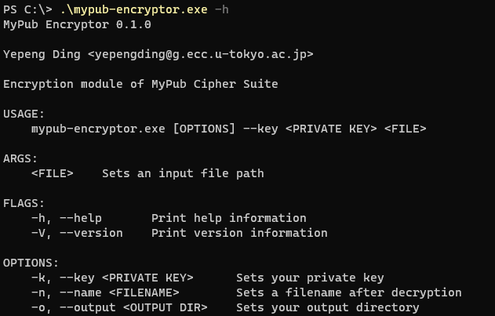

# MyPub Encryptor

Encryptor of MyPub Cipher Suite.

## Usage

```
USAGE:
    mypub-encryptor.exe [OPTIONS] --key <PRIVATE KEY> <FILE>

ARGS:
    <FILE>    Sets an input file path

FLAGS:
    -h, --help       Print help information
    -V, --version    Print version information

OPTIONS:
    -k, --key <PRIVATE KEY>      Sets your private key
    -n, --name <FILENAME>        Sets a filename after decryption
    -o, --output <OUTPUT DIR>    Sets your output directory
```

## Dependency

- [Git](https://git-scm.com/)
- [Rust Compiler](https://www.rust-lang.org/)

## Flow

1. Parse CLI argument to `Config` struct;
2. Read input file;
3. Generate passphrase from `GLOBAL_CONFIG`, `private_key`, and random identifier;
4. Encrypt file with passphrase;
5. Generate decryptor;
6. Output `encrypted file (.enc)`, `key (.key)`, and `decryptor (.dec[.exe])`.

## Development

### Configuration

> config.rs

- `network` Ethereum network
- `contract_address` Deployed publication contract address
- `decryptor` Decryptor repository

### Run tests

```shell
cargo test
```

### Build Debug

```shell
cargo build
```

### Build Release

```shell
cargo build --release
```

## UI



## MyPub Components

* [MyPub Front + Chain Linker](https://github.com/yepengding/MyPub/tree/main/ui)
* [MyPub Contract](https://github.com/yepengding/MyPub/tree/main/contracts)
* MyPub Cipher
    - [Encryptor](https://github.com/yepengding/MyPubEncryptor)
    - [Decryptor](https://github.com/yepengding/MyPubDecryptor)
* [MyPub Service](https://github.com/yepengding/MyPubService)

## Reference

- [age](https://docs.rs/age/0.6.0/age/)
- [clap](https://docs.rs/clap/3.0.0-beta.4/clap/)